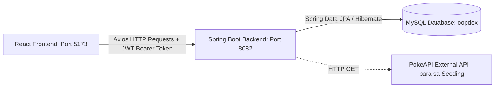

# 🔴 OOPDEX: Ultimate Study Guide & Q&A Reviewer (Taglish Edition) 🔵

Hello! Eto ang iyong **ultimate guide** para sa OOPDEX project. Dahil sabi mo hindi mo pa masyadong kabisado ang project natin, don't worry! Ginawa ko itong napaka-detalyado at nasa **Taglish** para madaling basahin at ma-gets agad. Perfect ito para sa paghahanda sa inyong presentation o panel defense (Q&A).

---

## 🗺️ Table of Contents
1. [Project Overview (Ano ba ang OOPDEX?)](#-project-overview-ano-ba-ang-oopdex)
2. [Architecture & Tech Stack (Paano ito binuo?)](#-architecture--tech-stack-paano-ito-binuo)
3. [Database Schema (Ang Estruktura ng Database natin)](#-database-schema-ang-estruktura-ng-database-natin)
4. [Backend Component Breakdown (Line-by-line & Folder Explanations)](#-backend-component-breakdown-line-by-line--folder-explanations)
5. [Frontend Component Breakdown (Paano gumagana ang React side?)](#-frontend-component-breakdown-paano-gumagana-ang-react-side)
6. [How OOP Concepts are Used (Dito ka gigisahin ng Panel!)](#-how-oop-concepts-are-used-dito-ka-gigisahin-ng-panel)
7. [Security & JWT Flow (Paano gumagana ang Login at Authorization?)](#-security--jwt-flow-paano-gumagana-ang-login-at-authorization)
8. [🔥 Top Q&A Questions & Answers (Ready-made Answers para sa Panel)](#-top-qa-questions--answers-ready-made-answers-para-sa-panel)

---

## 🌟 Project Overview (Ano ba ang OOPDEX?)

Ang **OOPDEX** ay isang **Pokemon Management Web Application**. 
* **Para sa Regular Users (ROLE_USER)**: Pwede silang mag-register, mag-login, mag-browse ng Generation 1 Pokemon (from Bulbasaur to Mew), mag-search, mag-filter gamit ang Type (e.g. Fire, Water), at "hulyihin" (catch) ang Pokemon para maidagdag sa sarili nilang **My Collection**. Pwede rin nilang lagyan ng **custom nickname** o "pakawalan" (release) ang kanilang mga nahuli.
* **Para sa Admins (ROLE_ADMIN)**: May access sila sa isang **Admin Dashboard**. Pwede silang mag-edit ng details ng Pokemon (height, weight, stats, etc.), mag-**soft-delete** ng Pokemon (itago sa listahan pero nasa DB pa rin), mag-restore ng soft-deleted Pokemon, mag-permanently delete ng Pokemon, at mag-manage ng users (pwedeng i-delete ang user accounts).
* **Automatic Seeding**: Kapag unang takbo ng program, kung walang laman ang database, automatic na tatawag ang backend natin sa external **PokeAPI** para i-download at i-save ang basic details ng Gen 1 Pokemon (ID 1 hanggang 151) kasama ang stats, abilities, at weaknesses nito.

---

## ⚙️ Architecture & Tech Stack (Paano ito binuo?)

Gumamit tayo ng **Decoupled Client-Server Architecture** (hiwalay si Frontend at Backend):



### 💻 1. Frontend (Client-side)
* **Vite + React.js**: Mas mabilis na build tool kumpara sa lumang Create React App (CRA).
* **Tailwind CSS**: Para sa modern at premium na responsive styling (bento grid cards, hover effects, dark-themed UI).
* **Axios**: HTTP library para sa pakikipag-usap (API requests) sa Spring Boot.

### ☕ 2. Backend (Server-side)
* **Java 17 & Spring Boot 3.2.5**: Ang core framework natin.
* **Spring Security & JWT (JSON Web Tokens)**: Para sa secured routes. Hindi tayo gumagamit ng traditional sessions; instead, binibigyan natin si React ng "ticket" o token tuwing maglo-login ang user.
* **Spring Data JPA & Hibernate**: Object-Relational Mapping (ORM). Ibig sabihin, hindi natin kailangang magsulat ng raw SQL statements (like `SELECT * FROM...`). JPA na ang bahalang mag-map ng Java classes natin papunta sa database tables natin sa MySQL.

### 🗄️ 3. Database (Data layer)
* **MySQL**: Ang Relational Database Management System (RDBMS) natin. Tumatakbo sa local machine sa port `3306`.
* **Database Name**: `oopdex`

---

## 🗃️ Database Schema (Ang Estruktura ng Database natin)

Mayroon tayong tatlong pangunahing tables na may **relationships**:

```mermaid
erDiagram
    USERS {
        Long id PK "AUTO_INCREMENT"
        varchar username UK "Unique username (3-20 chars)"
        varchar email UK "Unique email address"
        varchar password "BCrypt hashed password (secure)"
        varchar role "ROLE_USER or ROLE_ADMIN"
        datetime created_at "Timestamp ng registration"
    }
    POKEMONS {
        int id PK "Pokedex Number (e.g. 1 = Bulbasaur)"
        varchar name "Official name"
        decimal height "Height in meters"
        decimal weight "Weight in kg"
        varchar types "Comma-separated string (e.g. 'Grass, Poison')"
        varchar abilities "Comma-separated string"
        varchar weaknesses "Comma-separated string"
        int hp "Base HP (1-255)"
        int attack "Base Attack (1-255)"
        int defense "Base Defense (1-255)"
        int special_attack "Base Special Attack"
        int special_defense "Base Special Defense"
        int speed "Base Speed"
        boolean is_deleted "Soft-delete flag (default: false)"
    }
    COLLECTIONS {
        Long id PK "AUTO_INCREMENT"
        Long user_id FK "Owner of the caught pokemon"
        int pokemon_id FK "The caught pokemon ID"
        varchar nickname "User-assigned custom name"
        datetime date_caught "Timestamp when caught"
    }

    USERS ||--o{ COLLECTIONS : "owns"
    POKEMONS ||--o{ COLLECTIONS : "referenced in"
```



### 🗝️ Key Relationship:
* **Many-to-Many Relationship (conceptual)**: Ang relasyon ng `User` at `Pokemon` ay Many-to-Many (kasi ang isang User ay pwedeng makahuli ng maraming Pokemons, at ang isang Pokemon ID ay pwedeng mahuli ng maraming magkakaibang Users).
* **Implementation**: Binuo natin ito gamit ang isang intersection/bridge table na tinatawag na **`collections`** (represented ng [CaughtPokemon](file:///c:/Users/acer/Documents/New%20PokeDex/backend/src/main/java/com/oopdex/pokemon/CaughtPokemon.java) entity).
  * May unique constraint sa database: `@UniqueConstraint(columnNames = {"user_id", "pokemon_id"})`. Ang ibig sabihin nito, **isang beses lang pwedeng hulihin ng partikular na user ang isang klase ng Pokemon**. Hindi pwedeng magkaroon si User `X` ng dalawang Bulbasaur.

---

## ☕ Backend Component Breakdown (Line-by-line & Folder Explanations)

Ang backend code natin ay nahahati sa magkakaibang packages/folders para sa **Separation of Concerns** (malinis na code architecture).

```
backend/src/main/java/com/oopdex
│
├── 📂 auth       <-- Security, JWT tokens at authentication controllers
├── 📂 config     <-- CORS policy, Security filter configurations, at Data Seeder
├── 📂 exception  <-- Global error handling at custom HTTP error responses
├── 📂 pokemon    <-- Core business logic at endpoints para sa Pokemon & Catching
└── 📂 user       <-- User profile management at registration logic
```

### 📁 1. com.oopdex.pokemon (Core Entities & Logic)
* **[Pokemon.java](file:///c:/Users/acer/Documents/New%20PokeDex/backend/src/main/java/com/oopdex/pokemon/Pokemon.java) (Entity)**:
  * Ito ang blueprint ng Pokemon table sa DB. Gumagamit ito ng JPA validation annotations tulap ng `@Min(value = 1)` at `@Max(value = 255)` sa stats para masiguradong tama ang data.
  * Mayroon itong `@Transient` fields na `getType1()`, `getType2()`, `getSpriteUrl()`, at `getGifUrl()`. Ang ibig sabihin ng `@Transient`, **hindi ito sine-save sa MySQL table**. Kinakalkula lang ito on-the-fly ng Java code para ipadala sa frontend.
* **[CaughtPokemon.java](file:///c:/Users/acer/Documents/New%20PokeDex/backend/src/main/java/com/oopdex/pokemon/CaughtPokemon.java) (Entity)**:
  * Ito ang tagapamagitan ng `User` at `Pokemon`. May annotation itong `@ManyToOne(fetch = FetchType.LAZY)` sa field na `user` para i-link ito sa `User` entity nang hindi pabigat sa memorya (Lazy Loading).
  * Mayroon itong `@JsonIgnore` sa field na `user` para maiwasan ang **circular dependency infinite loop** kapag ginagawang JSON string ang data para ipadala sa React.
* **[PokemonRepository.java](file:///c:/Users/acer/Documents/New%20PokeDex/backend/src/main/java/com/oopdex/pokemon/PokemonRepository.java) (Data Access)**:
  * Isang interface na nag-eextend ng `JpaRepository<Pokemon, Integer>`. 
  * Naglalaman ito ng mga custom method signatures gaya ng `findByNameContainingIgnoreCaseAndIsDeletedFalse(String name)`. **Spring Data JPA** ang gumagawa ng SQL query nito nang kusa base sa pangalan ng method!
* **[PokemonService.java](file:///c:/Users/acer/Documents/New%20PokeDex/backend/src/main/java/com/oopdex/pokemon/PokemonService.java) (Business Logic)**:
  * Dito nilalagay ang validations. Halimbawa, nililinis nito ang text inputs gamit ang helper method na `normalizePokemon()` bago i-save.
  * Dito rin ginagawa ang **Soft Delete** (`setDeleted(true)` sabay save) para hindi tuluyang mawala sa database ang Pokemon kapag "binura" ng admin.
* **[PokemonController.java](file:///c:/Users/acer/Documents/New%20PokeDex/backend/src/main/java/com/oopdex/pokemon/PokemonController.java) (API Endpoints - Public & User)**:
  * Dito nakalagay ang endpoints para sa regular user actions gaya ng `GET /api/pokemon` (list all), `POST /api/pokemon/catch` (huli), at `DELETE /api/pokemon/release/{id}` (pakawalan).
  * Nilalagyan ito ng `@PreAuthorize("hasRole('USER')")` para matiyak na registered user lang ang makaka-access sa catching at releasing features.
* **[AdminPokemonController.java](file:///c:/Users/acer/Documents/New%20PokeDex/backend/src/main/java/com/oopdex/pokemon/AdminPokemonController.java) (API Endpoints - Admin-only)**:
  * Dito nakalagay ang administrative actions tulad ng soft-deleting (`DELETE /{id}`), restoring (`POST /{id}/restore`), at hard deleting (`DELETE /{id}/permanent`).
  * Nilagyan ito ng `@PreAuthorize("hasRole('ADMIN')")` sa class level o method level para harangan ang mga karaniwang user.

### 📁 2. com.oopdex.user (User Entities & Logic)
* **[User.java](file:///c:/Users/acer/Documents/New%20PokeDex/backend/src/main/java/com/oopdex/user/User.java) (Entity)**:
  * Naglalaman ng metadata ng user tulad ng username, email, password, at role.
  * May annotation na `@JsonProperty(access = JsonProperty.Access.WRITE_ONLY)` sa field na `password`. Napaka-importante nito para **hinding-hindi mapapadala ang password hash pabalik sa frontend** tuwing tatawagin ang user list endpoints.
  * May relationship na `@OneToMany(mappedBy = "user", cascade = CascadeType.ALL, orphanRemoval = true)` sa listahan ng `CaughtPokemon` (ibig sabihin kapag dinelete si user, damay burang mabubura ang mga nahuli niyang Pokemon).
* **[UserRepository.java](file:///c:/Users/acer/Documents/New%20PokeDex/backend/src/main/java/com/oopdex/user/UserRepository.java)**:
  * Query interface para maghanap ng users sa DB sa pamamagitan ng email o username.

### 📁 3. com.oopdex.auth (Authentication & JWT security)
* **[JwtUtil.java](file:///c:/Users/acer/Documents/New%20PokeDex/backend/src/main/java/com/oopdex/auth/JwtUtil.java)**:
  * Tool class para sa pagbuo (generate) at pag-validate ng JSON Web Tokens. Ito ang gumagawa ng encryption signature gamit ang `jwt.secret` at nagtatakda ng expiration (1 hour for access token, 7 days for refresh token).
* **[AuthController.java](file:///c:/Users/acer/Documents/New%20PokeDex/backend/src/main/java/com/oopdex/auth/AuthController.java)**:
  * Humahawak sa `/api/auth/register` at `/api/auth/login`.
  * Kapag maglo-login ang user, gagamitin ang `BCryptPasswordEncoder` para i-check kung tugma ang password. Kapag tugma, gagawa ito ng JWT at ibabalik ito sa response kasama ang username, email, at role ng user.

### 📁 4. com.oopdex.config (System Settings)
* **[SecurityConfig.java](file:///c:/Users/acer/Documents/New%20PokeDex/backend/src/main/java/com/oopdex/config/SecurityConfig.java)**:
  * Configures security rules. Idinedeklara dito na `/api/auth/**` at basic list endpoints ay **publicly accessible** (permitAll). Ang `/api/admin/**` naman ay strictly kailangang may role na `ADMIN`.
* **[DataInitializer.java](file:///c:/Users/acer/Documents/New%20PokeDex/backend/src/main/java/com/oopdex/config/DataInitializer.java)** at **[Gen1PokemonSeeder.java](file:///c:/Users/acer/Documents/New%20PokeDex/backend/src/main/java/com/oopdex/pokemon/Gen1PokemonSeeder.java)**:
  * Kapag nag-startup ang application (`CommandLineRunner`), checheck nito kung may laman na ang database. Kapag wala pa, automatic itong tatawag sa external `https://pokeapi.co/api/v2` para hanguin ang details ng first 151 Pokemon at isave sa database.

### 📁 5. com.oopdex.exception (Error Handler)
* **[GlobalExceptionHandler.java](file:///c:/Users/acer/Documents/New%20PokeDex/backend/src/main/java/com/oopdex/exception/GlobalExceptionHandler.java)**:
  * Gumagamit ng `@ControllerAdvice`. Interceptor ito sa buong system. Kapag may nag-throw ng error tulad ng `ResourceNotFoundException` o `DuplicateCatchException`, sasaluhin ito ng handler at aayusin ang JSON response format:
    ```json
    {
      "timestamp": "2026-05-31T20:48:17",
      "status": 409,
      "error": "Conflict",
      "message": "Pokemon already in your collection"
    }
    ```

---

## 💻 Frontend Component Breakdown (Paano gumagana ang React side?)

Ang frontend ay gumagamit ng modular page design sa ilalim ng `/frontend/src`:

* **[axios.js](file:///c:/Users/acer/Documents/New%20PokeDex/frontend/src/api/axios.js)**:
  * Ang core HTTP client. May **request interceptor** ito na kumukuha ng `token` sa localStorage ng browser at nilalagay ito bilang `Authorization: Bearer <token>` sa headers ng bawat request na ipapadala sa Spring Boot.
* **[AuthPage.jsx](file:///c:/Users/acer/Documents/New%20PokeDex/frontend/src/pages/AuthPage.jsx)**:
  * Login at Sign-up interface na may smooth layout transitions at input validations.
* **[LandingPage.jsx](file:///c:/Users/acer/Documents/New%20PokeDex/frontend/src/pages/LandingPage.jsx)**:
  * Ang welcome screen na may magandang modern header at dynamic features.
* **[Dashboard.jsx](file:///c:/Users/acer/Documents/New%20PokeDex/frontend/src/pages/Dashboard.jsx)**:
  * Ang sentro ng navigation depende sa kung sino ang naka-login. Kung Admin, may quick stats overview; kung ordinaryong User, may quick options para sa collection at catalog.
* **[MyCollection.jsx](file:///c:/Users/acer/Documents/New%20PokeDex/frontend/src/pages/user/MyCollection.jsx)**:
  * Dito nakikita ng registered user ang listahan ng mga Pokemon na nahuli niya. Pwede siyang maglagay ng nickname o mag-release ng Pokemon sa view na ito.
* **[PokemonCatalog.jsx](file:///c:/Users/acer/Documents/New%20PokeDex/frontend/src/pages/user/PokemonCatalog.jsx)**:
  * Ang pampublikong listahan kung saan pwede mag-search ng Pokemon, mag-filter by type, at pindutin ang "Catch" button.
* **[PokemonDatabase.jsx](file:///c:/Users/acer/Documents/New%20PokeDex/frontend/src/pages/admin/PokemonDatabase.jsx)**:
  * Dashboard ng Admin para makita ang listahan ng Pokemon, kasama ang soft-deleted records. Pwede silang mag-click ng edit, delete, o restore dito.

---

## 🧬 How OOP Concepts are Used (Dito ka gigisahin ng Panel!)

Ito ang pinaka-importanteng bahagi ng Q&A dahil **OOPDEX** ang pangalan ng project. Kailangan mong mapatunayan kung paano mo ginamit ang **4 Pillars of OOP**:

### 1. Encapsulation (Pagsasama ng Data at Methods)
* **Paliwanag**: Ginagawa nating `private` ang fields ng class natin (e.g. `id`, `name`, `password` sa `User.java` at `Pokemon.java`) para hindi sila direktang ma-modify mula sa labas. Nagbibigay tayo ng public `getter` at `setter` methods para kontrolado ang pag-access at pag-update sa data.
* **Halimbawa sa Code**:
  ```java
  private String nickname; // Encapsulated data

  public String getNickname() { // Safe read access
      return nickname;
  }
  public void setNickname(String nickname) { // Safe write access with logic
      this.nickname = nickname == null || nickname.isBlank() ? null : nickname.trim();
  }
  ```

### 2. Inheritance (Pagmamana ng Katangian)
* **Paliwanag**: Isang class ang nag-eextend o nagmamana ng features ng isa pang class. Binabawasan nito ang pag-uulit ng code (code reuse).
* **Halimbawa sa Code**:
  * Ang `DuplicateCatchException` at `CustomExceptions.ResourceNotFoundException` ay nag-eextend ng standard `RuntimeException` ng Java:
    ```java
    public class DuplicateCatchException extends RuntimeException {
        public DuplicateCatchException(String message) {
            super(message); // Tinatawag ang constructor ng parent class (RuntimeException)
        }
    }
    ```
  * Ang ating controller at config classes ay minamana rin ang mga behaviors mula sa core Spring libraries sa pamamagitan ng annotations at extends mechanisms.

### 3. Polymorphism (Maraming Anyo)
* **Paliwanag**:
  * **Overriding (Runtime Polymorphism)**: Pagbabago ng implementation ng minanang method mula sa parent class.
  * **Overloading (Compile-time Polymorphism)**: Magkaparehas na pangalan ng method pero magkaiba ng parameters.
* **Halimbawa sa Code (Overriding)**:
  * Sa security configuration or exception mapping, ino-override natin ang methods para magkaroon ng custom logic.
  * Kapag si `GlobalExceptionHandler` ay gumagamit ng dynamic handler mapping kung saan depende sa uri ng tinapong exception, ang tamang polymorphic error resolver method ang tatawagin ni Spring.

### 4. Abstraction (Pagtatago ng Complex Details)
* **Paliwanag**: Ipinapakita lang natin ang essential features sa labas nang hindi ipinapakita ang mahihirap na logic sa ilalim nito. Ginagawa ito gamit ang **Interfaces**.
* **Halimbawa sa Code**:
  * Ang [PokemonRepository](file:///c:/Users/acer/Documents/New%20PokeDex/backend/src/main/java/com/oopdex/pokemon/PokemonRepository.java) ay isang interface. 
    ```java
    public interface PokemonRepository extends JpaRepository<Pokemon, Integer> { }
    ```
    Hindi natin alam kung paano ginagawa sa background ang SQL connection or query execution ng `save()` o `findById()`. Alam lang natin na kapag tinawag natin ang method, makukuha natin ang data. Ang database management complex logic ay nakatago (abstracted).

---

## 🔒 Security & JWT Flow (Paano gumagana ang Login at Authorization?)

Dahil tinatanong madalas ng panel kung paano ginawang ligtas ang app, kailangang kabisado mo ang flow na ito:

1. **User Login**: I-eenter ni User ang email at password sa React frontend. Ipapadala ito via POST request sa `/api/auth/login`.
2. **Password Verification**: Hahanapin ng backend ang User sa DB gamit ang email. I-tsetsek ng `BCryptPasswordEncoder` kung match ang plaintext password sa hashed password na nasa database.
3. **Token Generation**: Kung match, gagawa ang `JwtUtil` ng **JWT Token**. Naglalaman ito ng payload (Username, Email, at Role gaya ng `ROLE_USER` o `ROLE_ADMIN`) na nilagdaan ng isang private security key gamit ang HS256 algorithm.
4. **Token Storage**: Ibabalik ng backend ang token sa React. Itatabi ito ng React sa `localStorage` ng browser.
5. **Authenticated Requests**: Tuwing hihiling ng data si React (gaya ng "hulihin ang pokemon"), isasama ng Axios interceptor ang token sa request header:
   `Authorization: Bearer <JWT_TOKEN_HERE>`
6. **Token Verification**: Bago makarating ang request sa Controller, dadaan muna ito sa [JwtAuthFilter](file:///c:/Users/acer/Documents/New%20PokeDex/backend/src/main/java/com/oopdex/config/JwtAuthFilter.java). Babasahin at i-veverify ng filter ang pirma ng token. Kung valid ang token, i-seset nito ang user state sa `SecurityContextHolder` ni Spring, at papayagan ang request na tumuloy sa controller.

---

## 🔥 Top Q&A Questions & Answers (Ready-made Answers para sa Panel)

Ito ang mga posibleng itanong ng inyong panel defense advisers tungkol sa **Backend** at **Database** ng inyong OOPDEX project. Narito ang mga sagot na siguradong makakakuha ng mataas na score (Excellent 5 sa rubric!).

### 🗄️ Database & JPA Questions

#### ❓ Q1: Bakit `@Table(name = "pokemons")` ang nakalagay sa inyong Pokemon entity pero ang entity class name niyo ay singular (`Pokemon.java`)?
* **Formal Answer**: *“We followed standard JPA conventions where the Java class represents a single instance of an object (hence, singular `Pokemon`), while the database table represents a collection of records, which is mapped to the plural form `pokemons` in our MySQL schema. This keeps our object-oriented design clean while adhering to relational database naming standards.”*
* **Taglish Explanation**: Sinusunod natin ang standard sa Java. Ang class name ay singular (`Pokemon`) kasi isang Pokemon instance lang ang kinakatawan nito sa code natin. Pero sa database table, marami silang Pokemon entries kaya ginawa nating plural (`pokemons`).

#### ❓ Q2: Sa inyong `application.properties`, nakalagay ay `spring.jpa.hibernate.ddl-auto=none`. Bakit hindi `update` o `create`? Ano ang ibig sabihin nito?
* **Formal Answer**: *“Setting `ddl-auto` to `none` prevents Hibernate from automatically modifying our database schema on application startup. In a production-like environment, this is a best practice because auto-update or auto-create features can lead to accidental data loss or unwanted schema modifications. It forces us to manage our database tables carefully and rely on pre-existing, stable schemas.”*
* **Taglish Explanation**: Kapag `none` ang setting natin, pinagbabawalan natin si Hibernate na pakialaman o baguhin ang structure ng tables natin sa MySQL. Ligtas ito kasi hindi nito mabubura ang data natin kapag nag-restart ang app, hindi katulad ng `create` na binubura at ginagawa ulit ang tables.

#### ❓ Q3: Paano gumagana ang custom queries sa Repository ninyo? Wala naman kayong ginawang query statement (SQL) pero gumagana ang `findByNameContainingIgnoreCaseAndIsDeletedFalse`?
* **Formal Answer**: *“We utilize Spring Data JPA's dynamic query creation feature. By following Spring Data's naming conventions for repositories, Hibernate interprets the method name at runtime and automatically translates it into the appropriate SQL query. For instance, `ContainingIgnoreCase` translates to a SQL `LIKE` statement with lowercase conversion, and `IsDeletedFalse` appends a `WHERE is_deleted = 0` condition. This abstracts the data access layer and saves us from writing manual boilerplate SQL queries.”*
* **Taglish Explanation**: Gawa ito ng **Spring Data JPA**. Binabasa ni Spring ang pangalan ng method natin (Query Method). Pag-start ng app, tina-translate ito ni Spring sa totoong SQL query. Halimbawa, ang `ContainingIgnoreCase` ay magiging `LIKE %pangalan%` sa SQL, at ang `IsDeletedFalse` ay magiging `WHERE is_deleted = false`. Sobrang laking bawas sa boilerplate code!

#### ❓ Q4: Ano ang logic ng inyong "Seeding" process gamit ang PokeAPI? Paano ito gumagana?
* **Formal Answer**: *“We implemented a seeder using Spring Boot's initialization phase. When the application starts up, the `DataInitializer` checks the `pokemons` table. If it is empty, the `Gen1PokemonSeeder` calls the external PokeAPI using `RestTemplate`. It fetches data sequentially for the first 151 Pokemon IDs, parses their stats, abilities, and type weaknesses from the JSON response, clamps values according to our entity validations, and persists them into our local MySQL database. This ensures the application has a ready-to-use dataset out of the box.”*
* **Taglish Explanation**: May seeder tayo. Kapag inistart ang server, tinitingnan nito kung walang laman ang database. Kung zero ang bilang ng Pokemon, gagamit ang backend ng `RestTemplate` para humingi ng data sa libreng PokeAPI website (mga Generation 1 Pokemon, ID 1 to 151). Kukunin ng Java code ang data, i-paparser ang stats, at ise-save sa local MySQL database natin para may laman agad ang app natin.

---

### ☕ Backend & Architecture Questions

#### ❓ Q5: Ano ang "Soft Delete" at bakit niyo ito ginamit sa `Pokemon` database ninyo imbes na burahin na lang nang direkta?
* **Formal Answer**: *“Soft delete is a technique where a record is not physically removed from the database table. Instead, a flag (in our case, `is_deleted`) is set to true. We implemented soft deletion for the Pokemon entity to maintain data integrity. If a Pokemon is permanently deleted, it could cause orphaned records or errors in the `collections` table if a user has caught that Pokemon. With soft delete, the Admin can make a Pokemon unavailable for new users to browse or catch, while keeping user history intact.”*
* **Taglish Explanation**: Ang **Soft Delete** ay hindi direktang nagbubura ng record sa database table. Nagpapalit lang tayo ng checkmark (ang variable na `isDeleted` ginagawang `true`). Ginawa natin ito para hindi masira ang database relationship natin. Kasi kung may user na nakahuli na ng Pikachu, tapos binura ng Admin si Pikachu sa table permanently, magkakaroon ng foreign key error or error sa inventory ng user. Kaya itinatago lang natin siya gamit ang flag pero nandoon pa rin sa database.

#### ❓ Q6: Ano ang pinagkaiba ng `@Controller` at `@RestController` sa Spring Boot?
* **Formal Answer**: *“A traditional `@Controller` is used to serve web views (such as HTML pages using Thymeleaf or JSP), where the return value of a method represents a page template name. On the other hand, `@RestController` is a convenience annotation that combines `@Controller` and `@ResponseBody`. It indicates that the class is a REST API controller where every method returns data serialized directly into JSON or XML format, which is perfect for communicating with a decoupled frontend application like React.”*
* **Taglish Explanation**: Ang `@Controller` ay para sa mga website na backend ang nagse-serve ng HTML pages (traditional web app). Ang `@RestController` naman ay ginagamit natin kasi **REST API** ang binuo natin. Ibig sabihin, hindi HTML page ang ibinabalik ng backend kundi **pure JSON data** na binabasa ng React frontend natin. Ito ay combination ng `@Controller` at `@ResponseBody`.

#### ❓ Q7: Paano ninyo hinahawakan (handle) ang error messages sa backend para hindi mag-crash ang app kapag may maling inputs?
* **Formal Answer**: *“We implemented a centralized error handling mechanism using a `@ControllerAdvice` class named `GlobalExceptionHandler`. This class intercepts all exceptions thrown by our controllers. Using `@ExceptionHandler` annotations, we map specific exceptions to custom JSON formats with appropriate HTTP status codes—such as returning `409 Conflict` for duplicate catches or `404 Not Found` for missing resources. This prevents raw server exceptions or stack traces from being exposed to the client and keeps our frontend running smoothly.”*
* **Taglish Explanation**: Gumamit tayo ng **Global Exception Handler** na may annotation na `@ControllerAdvice`. Tagasalo ito ng lahat ng errors sa buong application. Kapag nagkaroon ng error (e.g. sinubukang hulihin ang Pokemon na meron na siya, mag-tthrow ng `DuplicateCatchException`), sasaluhin ito ng exception handler at magbabalik ng maayos na JSON object na may HTTP status code (gaya ng 409 Conflict). Dahil dito, hindi nagka-crash ang React app at maganda ang error message na ipinapakita sa screen.

#### ❓ Q8: Ano ang kahalagahan ng `@PreAuthorize` annotation sa inyong Controllers?
* **Formal Answer**: *“The `@PreAuthorize` annotation implements Method-Level Security in Spring Security. It evaluates permissions before executing the target controller method. For example, `@PreAuthorize("hasRole('ADMIN')")` verifies if the authenticated user's JWT payload contains the `ROLE_ADMIN` authority. If the user does not possess this role, Spring Security automatically throws an `AccessDeniedException` and blocks execution, preventing unauthorized users from accessing privileged features.”*
* **Taglish Explanation**: Ang `@PreAuthorize` ay ginagamit natin sa security checking bago patakbuhin ang mismong coding logic ng endpoint natin. Kapag sinabi nating `@PreAuthorize("hasRole('ADMIN')")` sa admin controller, sinasabi natin kay Spring Security na tignan muna ang JWT ticket ng user. Kapag hindi siya Admin, huwag mong papasukin at ibalik mo agad ang error na `403 Forbidden` (Access Denied).

#### ❓ Q9: Saan at paano ninyo ginawa ang user security (Password Encryption)?
* **Formal Answer**: *“User password encryption is implemented inside the registration endpoint using the `BCryptPasswordEncoder` bean configured in our `SecurityConfig`. BCrypt is a secure, one-way hashing algorithm that automatically incorporates a random salt to protect against rainbow table attacks. When a user registers, we hash their plaintext password before saving it to the database. During login, Spring Security compares the incoming password with the stored hash using the `matches()` method.”*
* **Taglish Explanation**: Ini-encrypt natin ang password ng user tuwing sila ay magpaparehistro (register) gamit ang **BCrypt hashing algorithm**. Ito ay isang secured, one-way hash. Ibig sabihin, hindi natin sine-save ang password sa database nang nakabasa (plaintext); ginagawa natin itong random looking characters (hash). Kahit ma-hack ang database, hindi malalaman ng hacker ang totoong password ng user. Pag nag-login ang user, gumagamit tayo ng `matches()` method para i-verify kung tama ang tinayp nilang password laban sa hashed password sa database.

#### ❓ Q10: Ano ang gamit ng `@JsonIgnore` at `@JsonProperty(access = JsonProperty.Access.WRITE_ONLY)` sa inyong Entities?
* **Formal Answer**: *“`@JsonIgnore` is used to prevent circular reference loops during JSON serialization. For example, since `User` has many `CaughtPokemon` and each `CaughtPokemon` references the parent `User`, converting this structure to JSON would cause an infinite recursion error. By ignoring the `user` field in `CaughtPokemon`, we break this loop. Meanwhile, `@JsonProperty(access = Access.WRITE_ONLY)` on the password field allows users to set their password during registration but ensures the hashed password is never returned in JSON responses for security purposes.”*
* **Taglish Explanation**:
  * Ang `@JsonIgnore` ay inilalagay natin para iwasan ang **infinite loops** (circular reference). Halimbawa, kilala ni User ang kanyang CaughtPokemon, at kilala rin ni CaughtPokemon si User. Kapag ginawang JSON, paulit-ulit silang magtatawagan at mag-cracrash ang server. Kaya tinatago natin ang `user` field sa CaughtPokemon side.
  * Ang `@JsonProperty(access = Access.WRITE_ONLY)` naman sa user password field ay para mapayagan ang user na mag-type ng password pag-sign up, pero kapag tinawag ang data ng User, **hinding-hindi isasama ng backend ang password field** sa JSON response pabalik sa client. Safe at secure!

---

## 💡 Quick Tips para sa Defense:
1. **Maging Kumpiyansa (Be Confident)**: Huwag mong sasabihing "hindi ko po alam". Kung may itanong na hindi mo sure, sabihin mo: *"The architecture abstracts that layer, but based on Spring Boot principles, it does X..."*
2. **Kabisado ang Port Numbers**: React is running on Port `5173`, Spring Boot is on Port `8082`, at MySQL is on Port `3306`.
3. **I-highlight ang OOP**: Kaya tinawag na **OOPDEX** ang app dahil nakabatay ito sa Object-Oriented patterns sa Java tulad ng class encapsulation, inheritance ng exception layers, at abstraction ng repository layer.

Kayang-kaya mo ang inyong presentation! Kung may part dito na gusto mong mas lalimang talakayin, sabihin mo lang sa akin. Good luck! 🚀
