<div id="top" align="center">


# OOPDex

### *A Full-Stack Pokémon Management & Interactive Pokédex System*

[](https://spring.io/projects/spring-boot)
[](https://reactjs.org/)
[](https://vitejs.dev/)
[](https://www.mysql.com/)
[](https://tailwindcss.com/)
[](https://jwt.io/)
[](LICENSE)

<br />

<!-- Quick Jump Pill Buttons -->
<p align="center">
  <a href="#-overview"><b>📖 Overview</b></a> •
  <a href="#-role--permissions-matrix"><b>👥 Roles Matrix</b></a> •
  <a href="#-ui--user-flow-showcase"><b>📱 UI Showcase</b></a> •
  <a href="#-system-architecture"><b>🏗️ Architecture</b></a> •
  <a href="#-database-schema"><b>🗄️ Database</b></a> •
  <a href="#-api-endpoints"><b>📡 API Docs</b></a> •
  <a href="#-installation--setup"><b>⚙️ Setup</b></a> •
  <a href="#-default-credentials-local-development"><b>🔑 Credentials</b></a>
</p>

</div>

<br />
<hr />
<br />

## 📖 Overview

**OOPDex** is an enterprise-grade, full-stack Pokémon management and interactive Pokédex application. Combining a **React 18 (Vite + Tailwind CSS)** frontend with a robust **Spring Boot 3 (REST API + JPA + Security)** backend, OOPDex provides trainers with an immersive gaming experience and administrators with full data-lifecycle governance.

### Core Highlights
- **Gamified Drag-and-Drop Catch Mechanics:** Catch Pokémon from the Pokédex by dragging cards into the interactive Pokéball drop zone.
- **Release Mini-Game:** Release Pokémon through an interactive modal with real-time sound effects and animations.
- **Role-Based Access Control (RBAC):** Distinct permissions and views for Public Visitors, Registered Trainers (`ROLE_USER`), and Professor Oak (`ROLE_ADMIN`).
- **Auto-Seeding with PokeAPI:** On startup, automatically synchronizes and validates all 151 Generation 1 Pokémon data, stats, abilities, and type matchups.
- **Safe Soft-Delete & Recovery Lifecycle:** Admin capabilities to soft-delete, review in archive, restore, or permanently purge Pokémon entries.

<br />

<div align="right">
  <a href="#top">▲ Back to Top</a>
</div>

<br />
<hr />
<br />

## 👥 Role & Permissions Matrix

| Feature | Public Visitor | Registered Trainer (`ROLE_USER`) | Professor Oak (`ROLE_ADMIN`) |
| :--- | :---: | :---: | :---: |
| Browse 151 Gen 1 Pokédex | ✅ | ✅ | ✅ |
| Filter by Type & Search by Name/ID | ✅ | ✅ | ✅ |
| View Detailed Stats & Weaknesses Modal | ✅ | ✅ | ✅ |
| Catch Pokémon (Drag & Drop) | ❌ | ✅ | ❌ |
| Manage Personal Collection & Nicknames | ❌ | ✅ | ❌ |
| Release Pokémon (Mini-Game) | ❌ | ✅ | ❌ |
| Edit Global Pokémon Stats & Attributes | ❌ | ❌ | ✅ |
| Soft-Delete & Restore Pokémon Records | ❌ | ❌ | ✅ |
| Permanent Record Purging | ❌ | ❌ | ✅ |
| User Management (View & Evict Trainers) | ❌ | ❌ | ✅ |

<br />

<div align="right">
  <a href="#top">▲ Back to Top</a>
</div>

<br />
<hr />
<br />

## 📱 UI & User Flow Showcase

### 1. Public Landing Page & Pokédex Explorer

The Landing Page serves as the public entry point where any visitor can explore Generation 1 Pokémon with dynamic filtering, live search, and stat inspection modals.

<div align="center">
  <table>
    <tr>
      <td align="center"><b>Hero Header</b></td>
      <td align="center"><b>Live Search & Filter</b></td>
      <td align="center"><b>Pokédex Grid</b></td>
    </tr>
    <tr>
      <td>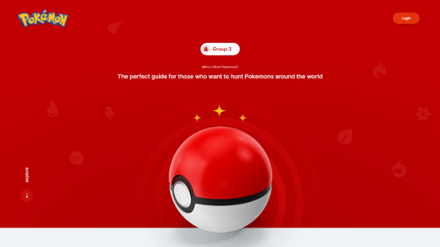</td>
      <td>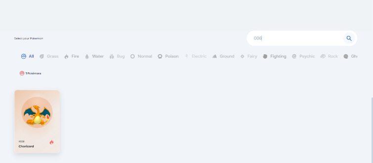</td>
      <td>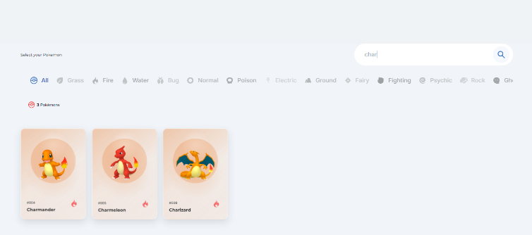</td>
    </tr>
    <tr>
      <td align="center"><b>Pokémon Stats Modal</b></td>
      <td align="center"><b>Footer & Credits</b></td>
      <td align="center"><b>Responsive Layout</b></td>
    </tr>
    <tr>
      <td>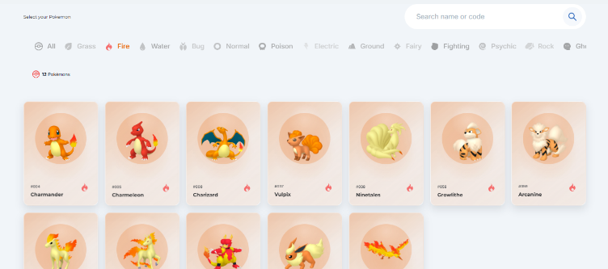</td>
      <td>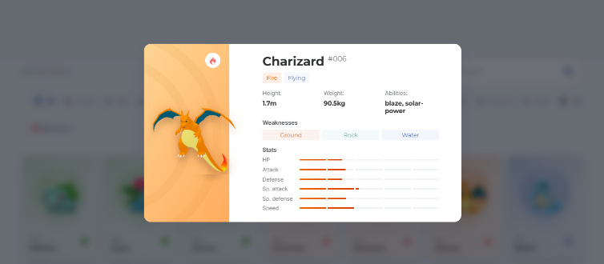</td>
      <td></td>
    </tr>
  </table>
</div>

<br />
<hr style="border-top: 1px dashed #444;" />
<br />

### 2. Authentication Gateway (Login & Registration)

Secure JWT authentication enforcing `@pokemon.lab` institutional domain validation and password strength requirements.

<div align="center">
  <table>
    <tr>
      <td align="center"><b>Trainer & Admin Sign In</b></td>
      <td align="center"><b>New Trainer Registration</b></td>
    </tr>
    <tr>
      <td>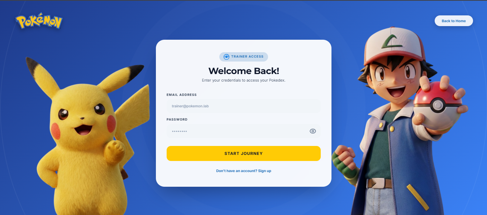</td>
      <td>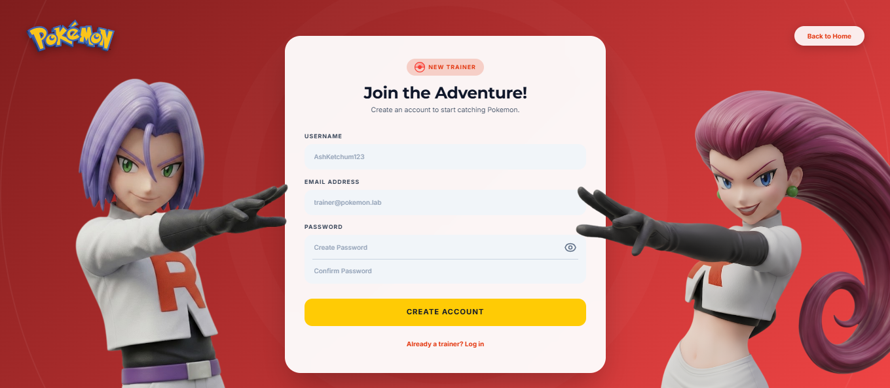</td>
    </tr>
  </table>
</div>

<br />
<hr style="border-top: 1px dashed #444;" />
<br />

### 3. Trainer Dashboard & Catch / Release Gameplay

#### Drag & Drop Catch Mechanic
Trainers can catch Pokémon by double-tapping a card and dragging it to the active Pokéball target at the bottom of the screen.

<div align="center">
  <table>
    <tr>
      <td align="center"><b>1. Drag to Pokéball Target</b></td>
      <td align="center"><b>2. Catching Animation</b></td>
      <td align="center"><b>3. "Gotcha!" Success</b></td>
      <td align="center"><b>4. Captured State (Grayed)</b></td>
    </tr>
    <tr>
      <td>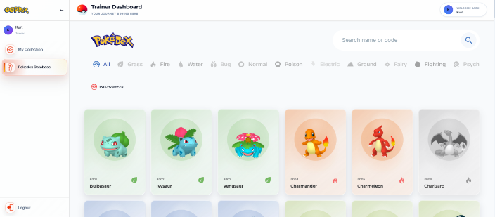</td>
      <td>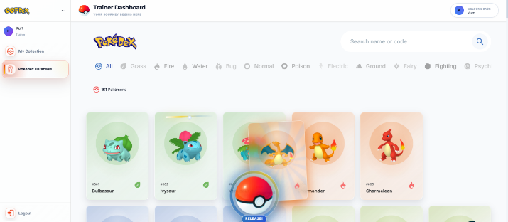</td>
      <td>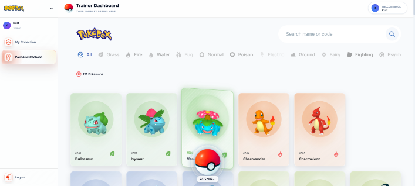</td>
      <td>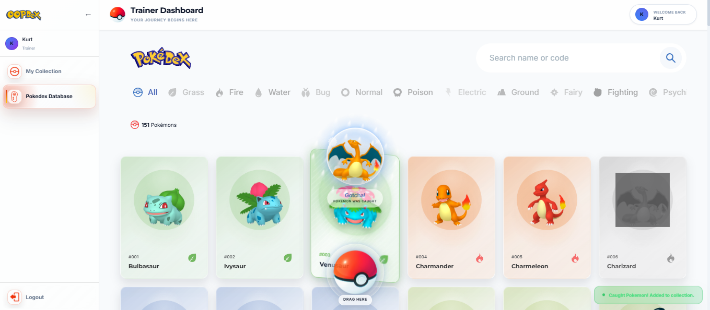</td>
    </tr>
  </table>
</div>

<br />

#### Interactive Release Mini-Game
In **My Collection**, trainers can manage captured Pokémon and trigger the release mini-game.

<div align="center">
  <table>
    <tr>
      <td align="center"><b>1. Hover Release Icon</b></td>
      <td align="center"><b>2. Drag Ball to Release</b></td>
      <td align="center"><b>3. "Released!" Confirmation</b></td>
      <td align="center"><b>4. Collection Updated</b></td>
    </tr>
    <tr>
      <td>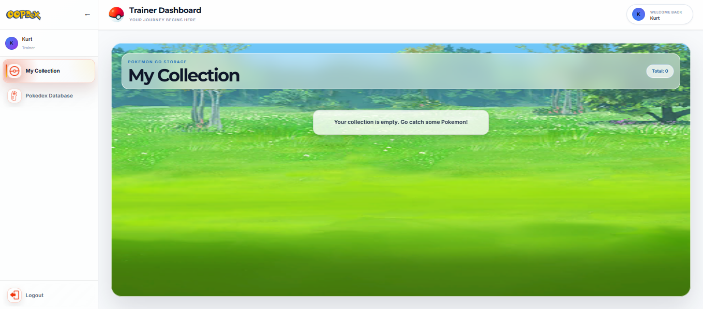</td>
      <td>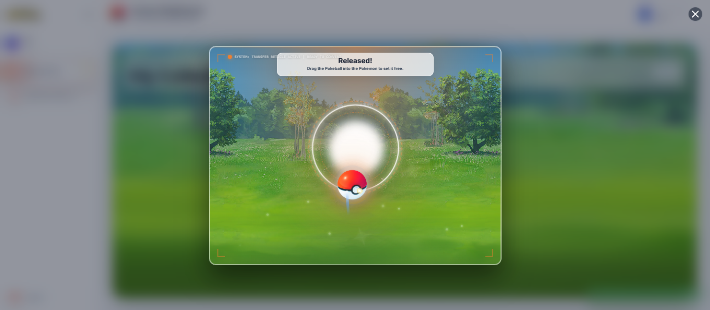</td>
      <td>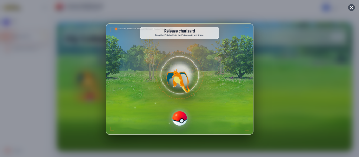</td>
      <td>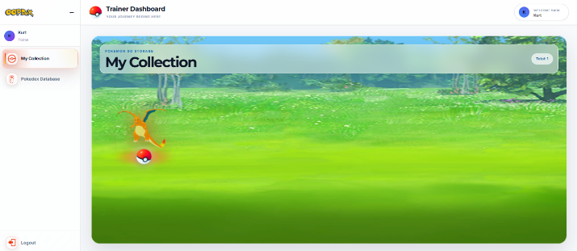</td>
    </tr>
  </table>
</div>

<br />
<hr style="border-top: 1px dashed #444;" />
<br />

### 4. Admin Control Center (Professor Oak)

Professor Oak has exclusive access to modify Pokémon attributes, manage the soft-delete/restore lifecycle, and administer registered trainer accounts.

<div align="center">
  <table>
    <tr>
      <td align="center"><b>Active Pokémon Database</b></td>
      <td align="center"><b>Trainer User Management</b></td>
    </tr>
    <tr>
      <td>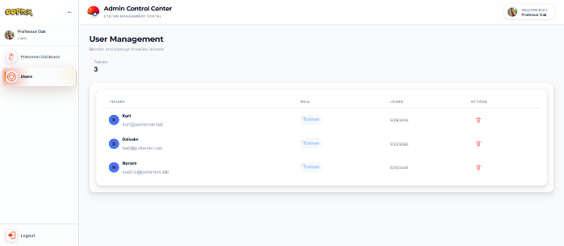</td>
      <td>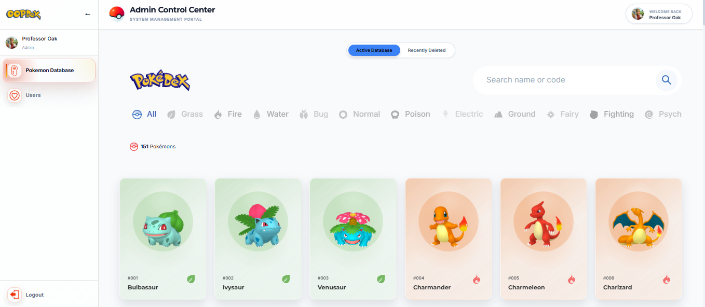</td>
    </tr>
    <tr>
      <td align="center"><b>Admin Actions on Modal</b></td>
      <td align="center"><b>Pokémon Edit Form</b></td>
    </tr>
    <tr>
      <td>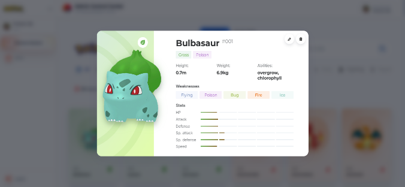</td>
      <td>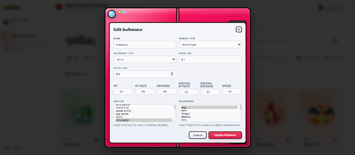</td>
    </tr>
  </table>
</div>

<br />

#### Soft-Delete & Archive Restoration Flow
<div align="center">
  <table>
    <tr>
      <td align="center"><b>1. Delete from Active</b></td>
      <td align="center"><b>2. Moved to Archive</b></td>
      <td align="center"><b>3. Restoring Record</b></td>
      <td align="center"><b>4. Restored to Active</b></td>
    </tr>
    <tr>
      <td>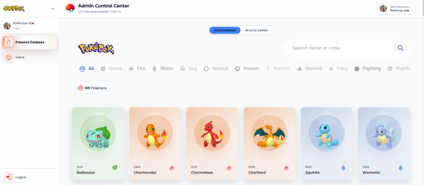</td>
      <td>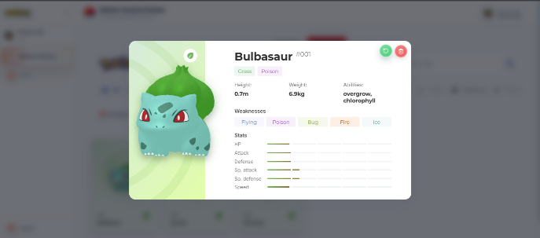</td>
      <td>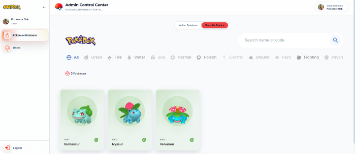</td>
      <td>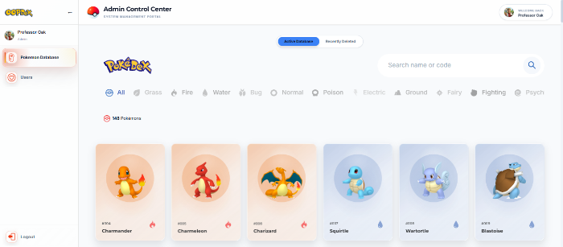</td>
    </tr>
  </table>
</div>

<br />

<div align="right">
  <a href="#top">▲ Back to Top</a>
</div>

<br />
<hr />
<br />

## 🏗️ System Architecture

The project follows a decoupled client-server architecture with an MVC Service-Repository design pattern:

```
 PokeDex Project
 ├── 🎨 frontend/ (React 18 + Vite + Tailwind CSS)
 │    ├── src/api/axios.js            # Axios client with JWT interceptor
 │    ├── src/context/AuthContext.jsx # Auth state, login/logout, roles
 │    ├── src/components/             # Reusable UI & Modal components
 │    ├── src/pages/                  # Landing, Auth, Dashboard, Admin views
 │    └── src/styles/                 # Custom Game CSS & Design System
 │
 └── ⚙️ backend/ (Spring Boot 3 + Spring Security + JPA)
      ├── auth/                       # JWT Generation, Filters & UserDetails
      ├── config/                     # SecurityConfig, CORS, DataInitializer
      ├── exception/                  # GlobalExceptionHandler (Clean JSON)
      ├── pokemon/                    # Pokemon entities, DTOs, Seeder, Service
      └── user/                       # User management & Profile services
```

<br />

<div align="right">
  <a href="#top">▲ Back to Top</a>
</div>

<br />
<hr />
<br />

## 🗄️ Database Schema

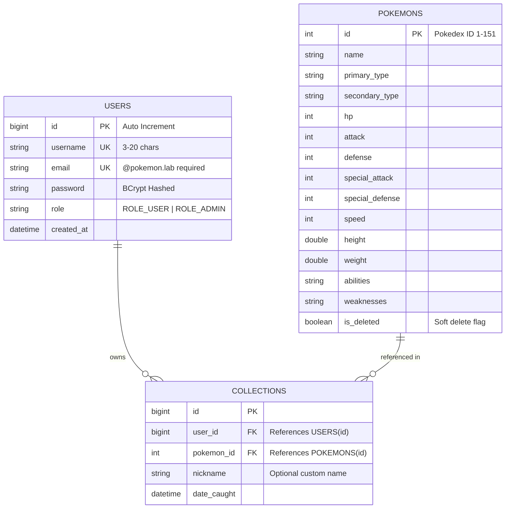

<br />

<div align="right">
  <a href="#top">▲ Back to Top</a>
</div>

<br />
<hr />
<br />

## 📡 API Endpoints

### Authentication (`/api/auth`)
| Method | Endpoint | Access | Description |
| :--- | :--- | :---: | :--- |
| `POST` | `/api/auth/register` | Public | Register a new user (`@pokemon.lab` email required) |
| `POST` | `/api/auth/login` | Public | Authenticate credentials and receive JWT token |

<br />
<hr style="border-top: 1px dashed #444;" />
<br />

### Pokémon Catalog (`/api/pokemon`)
| Method | Endpoint | Access | Description |
| :--- | :--- | :---: | :--- |
| `GET` | `/api/pokemon` | Public | Retrieve all active (non-deleted) Pokémon |
| `GET` | `/api/pokemon/{id}` | Public | Retrieve single Pokémon by ID |
| `GET` | `/api/pokemon/search?name={name}` | Public | Search active Pokémon by name |
| `GET` | `/api/pokemon/filter?type={type}` | Public | Filter active Pokémon by element type |
| `POST` | `/api/pokemon/catch` | `ROLE_USER` | Add Pokémon to authenticated user's collection |
| `GET` | `/api/pokemon/my-collection` | `ROLE_USER` | Retrieve authenticated user's captured Pokémon |
| `PUT` | `/api/pokemon/{caughtId}` | `ROLE_USER` | Update custom nickname for a caught Pokémon |
| `DELETE`| `/api/pokemon/release/{caughtId}`| `ROLE_USER` | Release (delete) Pokémon from collection |

<br />
<hr style="border-top: 1px dashed #444;" />
<br />

### Admin Management (`/api/admin`)
| Method | Endpoint | Access | Description |
| :--- | :--- | :---: | :--- |
| `GET` | `/api/admin/pokemon/deleted` | `ROLE_ADMIN` | List all soft-deleted Pokémon in archive |
| `PUT` | `/api/admin/pokemon/{id}` | `ROLE_ADMIN` | Update Pokémon stats, types, or attributes |
| `DELETE`| `/api/admin/pokemon/{id}` | `ROLE_ADMIN` | Soft-delete a Pokémon from active catalog |
| `POST` | `/api/admin/pokemon/{id}/restore` | `ROLE_ADMIN` | Restore soft-deleted Pokémon back to active |
| `DELETE`| `/api/admin/pokemon/{id}/permanent` | `ROLE_ADMIN`| Permanently delete Pokémon record |
| `GET` | `/api/admin/users` | `ROLE_ADMIN` | List all registered users |
| `GET` | `/api/admin/users/{id}` | `ROLE_ADMIN` | Retrieve user details by ID |
| `DELETE`| `/api/admin/users/{id}` | `ROLE_ADMIN` | Evict / delete user account |

<br />

<div align="right">
  <a href="#top">▲ Back to Top</a>
</div>

<br />
<hr />
<br />

## ⚙️ Installation & Setup

### Prerequisites
- **Java 17+** (JDK 17 or JDK 21 recommended)
- **Node.js 18+** & `npm`
- **MySQL 8.0+**

<br />

---

### Step 1: Database Setup
Create the MySQL database:
```sql
CREATE DATABASE oopdex;
CREATE USER 'oopdex'@'localhost' IDENTIFIED BY 'Admin@123';
GRANT ALL PRIVILEGES ON oopdex.* TO 'oopdex'@'localhost';
FLUSH PRIVILEGES;
```

<br />

---

### Step 2: Backend Setup
1. Navigate to the backend directory:
   ```bash
   cd backend
   ```
2. *(Optional)* Configure environment variables in `application.properties` or your environment:
   ```properties
   DB_URL=jdbc:mysql://localhost:3306/oopdex
   DB_USERNAME=oopdex
   DB_PASSWORD=Admin@123
   JWT_SECRET=your-secure-256-bit-secret-key
   ```
3. Run the Spring Boot application:
   ```powershell
   # Windows
   .\mvnw.cmd spring-boot:run

   # Linux / macOS
   ./mvnw spring-boot:run
   ```
   *The backend starts at `http://localhost:8082` and automatically seeds Generation 1 Pokémon and Professor Oak's admin account.*

<br />

---

### Step 3: Frontend Setup
1. Open a new terminal and navigate to `frontend`:
   ```bash
   cd frontend
   ```
2. Install npm dependencies:
   ```bash
   npm install
   ```
3. Start the Vite development server:
   ```bash
   npm run dev
   ```
4. Open your browser and navigate to:
   ```
   http://localhost:5173
   ```

<br />

<div align="right">
  <a href="#top">▲ Back to Top</a>
</div>

<br />
<hr />
<br />

## 🔑 Default Credentials (Local Development)

| Role | Username | Email | Default Password |
| :--- | :--- | :--- | :--- |
| **Administrator** | `oak` | `oak@pokemon.lab` | `prof_oak_123` |
| **New Trainer** | *Any* | `*@pokemon.lab` | *Min 8 characters* |

> 💡 **Security Tip:** The default admin account is seeded for local development and demonstration purposes only. When deploying to a production server, override these credentials via the `APP_ADMIN_EMAIL` and `APP_ADMIN_PASSWORD` environment variables.

<br />

<div align="right">
  <a href="#top">▲ Back to Top</a>
</div>

<br />
<hr />
<br />

## 🧪 Tech Stack Summary

```
Frontend:   React 18 • Vite • Tailwind CSS • Axios • Lucide React • React Router v6
Backend:    Java 17+ • Spring Boot 3.2.5 • Spring Security • Spring Data JPA • JJWT
Database:   MySQL 8.0 • Hibernate 6
Tooling:    Maven Wrapper • PostCSS • ESLint • Git
```

<br />

<div align="right">
  <a href="#top">▲ Back to Top</a>
</div>

<br />
<hr />
<br />

<div align="center">


<br />

### Made with ❤️ for Pokémon Trainers & Developers everywhere

*“Gotta Catch 'Em All!”*

<br />

</div>

